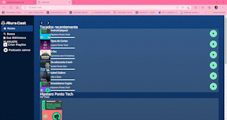

<h1>ALURACAST</h1> 

   

> Status do Projeto: :warning: em desenvolvimento

### Tópicos 

:small_blue_diamond: [Descrição do projeto](#descrição-do-projeto)

:small_blue_diamond: [Deploy da Aplicação](#deploy-da-aplicação-dash)

## Descrição do projeto 

  Projeto com propósito de aprendizado de grid container.

## Layout ou Deploy da Aplicação :dash:

## Casos de Uso

